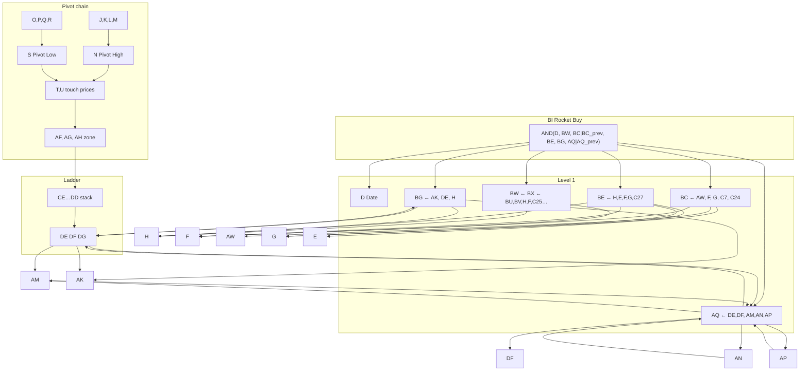

# Sheet dependency tree — **BI (Rocket Buy)** and downstream

> **Layout warning (2026):** `sheet_column_reference.SHEET_HEADERS` is authoritative for letters.
> In the current map, **AL** = *BRT Rocket buy*, **AI** = *Range Qualifier*, **BC** = *ATH filter*;
> **AI** and **BC** are **not** inputs to the **AL** buy signal. The `AND` example below is a **snapshot**
> from an older workbook where **BI** was Rocket Buy and **BC** was used as a range input — **do not**
> treat **BC** here as today’s *ATH filter* column.

This document reflects **your current sheet** (column **BI** = Rocket Buy), not the older **BH / BV / BB** snapshot in `Rocket_Buy_Dependency_Guide.md`.

---

## 1. Rocket Buy (**BI**) — direct inputs

```text
=AND(
  $D8  >= DATE(2019,1,1),
  $BW8 = TRUE,
  OR($BC8=TRUE, $BC7=TRUE),
  $BE8 = TRUE,
  $BG8 = TRUE,
  OR($AQ8=TRUE, $AQ7=TRUE)
)
```

| Column | Role (short name) |
|--------|-------------------|
| **D** | Trading date (row must be ≥ 2019-01-01) |
| **BW** | Growth / range gate (see §2 — aliases **BX** in your paste) |
| **BC** | *(legacy snapshot)* was “range qualifier” here; current sheet: **BC** = ATH filter (`sheet_column_reference`), not an **AL** buy input |
| **BE** | Bullish bar + close position in bar (**C27**) |
| **BG** | Level acceptance (7/10 style vs **DE** anchor) |
| **AQ** | Zone eligible long (today **or** yesterday) |

**Note:** **Column M** is **not** in this `AND`. It feeds **N/S** (Pivot High / Pivot Low labels) and the rest of the pivot → touch → zone → **DE/DF** chain that **AQ** and **BG** use.

---

## 2. Level 1 — what each **BI** input depends on

### **D** (Date)
- `=WORKDAY.INTL(D7, 1, 1, Holidays!B:B)` (or equivalent)
- **Depends on:** prior row date **D7**, holiday list **Holidays!B:B**, calendar rules.

### **E–I** (prices / volume)
- **E:** `QUERY(GOOGLEFINANCE(C$1, "all", D8, D8), …)` → OHLCV for **D8**
- **F, G, H, I:** Open / High / Low / Close / Volume (as split from **E** or adjacent columns in your layout)
- **Leaf:** ticker **C$1**, date **D8**, market data.

### **J–M** (pivot *tests* — no “Pivot High/Low” label yet)
| Col | Typical header (from your list) | Depends on (conceptually) |
|-----|----------------------------------|----------------------------|
| **J** | Local High Test | **F**, **F** window, **C23** |
| **K** | Future Rise test (from high) | **F**, **G** forward window, **C21** |
| **L** | No dup Pivot High | **N**, **T**, **F**, **C22** | *(Engine sheet-touch: L disabled PO 2026-07-20 — twin Final PHs allowed)* |
| **M** | Not also Pivot Low | **F**, **G**, **S**, **U**, **C21–C23** |

### **N** (Final Pivot High label)
- `IF(AND(J,K,L,M),"Pivot High","")`
- **Depends on:** **J, K, L, M** (all TRUE → label **N**).

### **O–R** (pivot low side tests)
| Col | Role | Feeds |
|-----|------|--------|
| **O** | Local Low test | **S** |
| **P** | Future rise from low | **S** |
| **Q** | COUNTIFS prior Pivot Lows in band | **S** |
| **R** | Not also Pivot High (mirror logic) | **S** |

### **S** (Pivot Low label)
- `IF(AND(O,P,Q,R),"Pivot Low","")`
- **Depends on:** **O, P, Q, R**.

### **T, U** (touch prices from pivots)
- **T:** `IF(N="Pivot High", F, "")`
- **U:** `IF(S="Pivot Low", G, "")`
- **Depends on:** **N**, **S**, **F**, **G**.

### **V–W** (forward-filled touch / zone centers)
- Carry logic from prior row; **T, U**.

### **X–AA** (structure tags)
- **HH / LH / HL / LL** from **T, U** vs prior **V, W**.

### **AB–AC** (Major High / Major Low)
- From **N/S** and forward **MATCH** into **S** / **N** columns.

### **AD–AE** (pivot strength flags)
- **IFERROR** windows with **C17**, **C18**; **N**, **S**, **F**, **G**.

### **AF** (chosen zone level for row)
- Picks **F** or **G** when pivot + strength conditions (**AD/AE**, **C14**, **C15**).

### **AG–AH** (zone lower / upper = band around **AF**)
- `AG = AF*(1-C5)`, `AH = AF*(1+C5)` (**C5** = band %).

### **AK–AP** (overlap / evidence building blocks for ladder row)
Your paste shows **six** formulas before **AM** — typical pattern:
- **AK–AN:** overlap / support / resistance style tests using **DE, DF, DG, H, F, G, H7**
- **AM:** `COUNTIFS` on **AK** + **DF** in window (**C10**)
- **AN:** `COUNTIFS` on **AL** + **DH** in window
- **AO:** `AND(AM, AN)` when **DE/DF** present
- **AP:** `MAX(H window) > DF` (**C16** window)

(Exact column letters **AK…AP** should match your header row.)

### **AQ** (Zone eligible long)
```text
=IF(OR(DE="", DF=""), "",
  OR(AM=TRUE, AND(AN=TRUE, AP=TRUE))
)
```
- **Depends on:** **DE, DF** (non-empty), **AM**, **AN**, **AP**.

### **AR–AU** (touch / maturity chain toward **AW**)
- **AR:** COUNTIFS on **CD** in **[DE, DF]** band vs **C6**
- **AS:** **AR ≥ C6**
- **AT/AU:** window counts vs **CE/CF**, **C11** — feeds **AV**.

### **AV** (combined touch gate)
- `=IF(AND(AS=TRUE,AU8=TRUE),TRUE,FALSE)`

### **AW** (long touch-count / AW flag)
- `=IF(N(AR8)=0,"", AND(N(AR8)>=C6, OR(N(AR7)<C6, DH8<>DH7)))`
- **Depends on:** **AR**, **DH**, **C6**.

### **AX–BB** (consolidation box — **CB** / inside counts)
- **AY, AZ:** box bounds from pivots / price
- **BA, BB:** counts of inside highs/lows; **O/S/T/U** pivot labels.

### **BC** (Range qualifier — feeds **BI**)
```text
=IF(OR(AW<>TRUE, ROW()<=C24), "",
  (MAX(F window)/MIN(G window) - 1) > C7)
```
- **Depends on:** **AW**, **C24**, **F**, **G**, **C7**.

### **BD** (downstream of **BI** / in-trade — not inside **BI** `AND`)
- Often entry/target helpers; your paste ties **BD** to **BL/BI**.

### **BE** (Bullish + close in upper part of bar — feeds **BI**)
```text
=AND(H>E, H >= G + ((F-G)*C27))
```
- **Depends on:** **H, E, F, G**, **C27**.

### **BW** (Growth gate — feeds **BI**)
Your paste shows **`BW` = `BX`** (one column references the next):
- **BX:** `=IFERROR(H >= C25 * MAX(F$2:F8), FALSE)` (short horizon vs highs)
- **BU / BV / BW:** longer horizons (rows **−252, −504, −756**) and `N(BU)+N(BV)+N(BW) >= 2` style rule
- **BW** (as used in **BI**) ultimately traces to **H**, **F**, **C25**, **C26**, **C13**, **CC**, **BU**, **BV**, **BX**.

---

## 3. **BG** (Level acceptance) — second block

```text
=IF(OR(AK8=TRUE, AK7=TRUE),
  COUNTIF(INDEX(H:H, MAX(2,ROW()-9)):H8, ">" & IF(AK8, DE8, DE7)) >= 7,
  FALSE)
```

- **Depends on:** **AK** (today or yesterday), **H** (closes in window), **DE** (active zone lower from ladder), **ROW**.

So **BG** needs **AK** **and** the **DE** column from the **8-rung ladder** block (**CE…DG**), not only **D–BE**.

---

## 4. Ladder / active zone (**CE…DG**) — feeds **DE, DF, DG, DH**

Your formulas implement **lagged CE/CF → CG…DC stack → DE/DF/DG** (same pattern as `unused_columns_scan.py` / `SHEET_PARITY_DIFF.md`):

- **CE, CF, CG…DD:** stacked zone lowers/uppers / maturity indices
- **DE:** first overlapping rung lower (**F/G** vs rungs)
- **DF:** matching upper
- **DG:** maturity row index
- **DH:** slot index (1–8)

**DI:** `=AND(DE<>"", ROW()>DG)` — “price row is **after** maturity row for active **DE**”.

**AQ** and **AK** use **DE/DF/DG**; if **DE/DF** are blank, **AQ** is blank / FALSE and **BI** fails via **OR(AQ, AQ7)**.

---

## 5. Mermaid — **BI** at center (high level)



---

## 6. How **M** connects to **BI** (indirect)

- **M** is **not** a direct operand of **BI**.
- **M** → **N** (with **J, K, L**) → **T** → **V/W** → … → **AF** → **CE/CF** → **ladder** → **DE/DF/DG** → **AK, AM, AN, AP, AQ** → **BI**.

So **M** can still **block** Rocket Buy **indirectly** by changing **which** pivots / zones feed **AF** and the ladder, hence **DE/DF** and **AQ**.

---

## 7. Constants referenced (by symbol — your **C** cells)

| Symbol | Typical meaning (from your docs / paste) |
|--------|------------------------------------------|
| **C5** | Zone band % |
| **C6** | Touch threshold (e.g. 6) |
| **C7** | Tight range / range qualifier threshold |
| **C10** | Short window for **AM** / **AN** counts |
| **C11** | Window for **AT** |
| **C13** | Displacement / balance threshold |
| **C14** | CE/CF lag (sheet ladder) |
| **C15** | Breakout threshold for **AF** |
| **C16** | **AP** lookback window |
| **C17–C18** | Pivot strength lookback / threshold |
| **C21–C23** | `pivot_future_move_pct`, `pivot_dedup_tol_pct`, `pivot_local_window_bars` |
| **C24** | Min row for **BC** range test |
| **C25–C26** | Short / long growth vs **MAX(F)** |
| **C27** | **BE** close position in bar |

---

## 8. Old vs new naming (for grep / parity)

| Old guide (`Rocket_Buy_Dependency_Guide.md`) | Your current sheet |
|---------------------------------------------|---------------------|
| **BH** Rocket Buy | **BI** Rocket Buy |
| **BV** | **BW** (via **BX** / **BU/BV**) |
| **BB** | **BC** |
| **BD** | **BE** |
| **BF** | **BG** |
| **AJ** Support test | Folded into **AK** + **DE** ladder context |
| **AP** Zone eligible | **AQ** |

---

*Generated from formulas you pasted (rows **8** sample). Adjust row indices if your formulas differ by row.*
